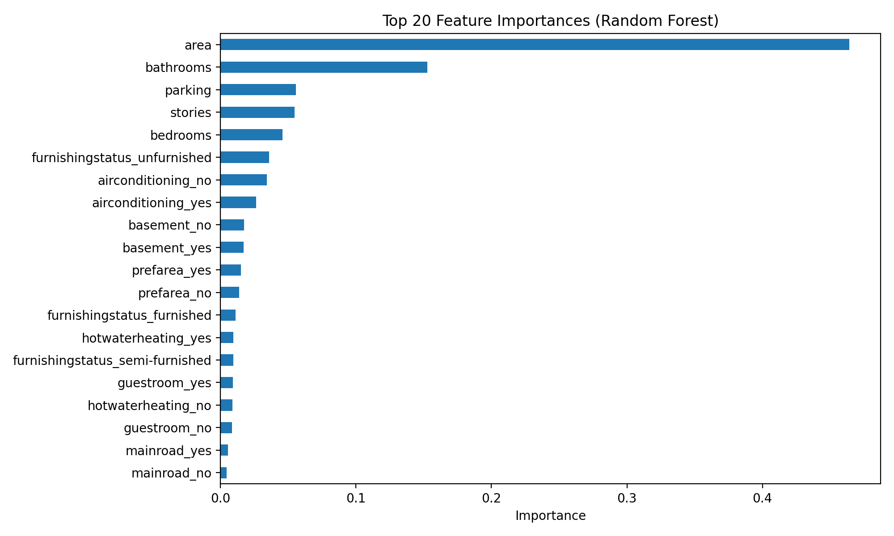

# 🏠 House Price Prediction (Machine Learning Project)

An end-to-end **Machine Learning regression project** that predicts house prices using a **Random Forest model**, supported by exploratory data analysis (EDA), feature importance analysis, and an interactive **Streamlit web application**.

This project demonstrates clean ML fundamentals, proper preprocessing, evaluation, and simple model deployment.

---

## 📌 Problem Statement
Accurately estimating house prices is important for buyers, sellers, and real-estate businesses.  
This project builds a machine learning model that predicts house prices based on property characteristics such as area, number of rooms, amenities, and furnishing status.

---

## 🗂 Dataset
- **File:** `housing.csv`
- **Target Variable:** `price`
- **Features include:**
  - Area, bedrooms, bathrooms, stories, parking
  - Main road access, guest room, basement
  - Hot water heating, air conditioning
  - Preferred area, furnishing status

The dataset contains a mix of **numerical and categorical features**, making it suitable for demonstrating preprocessing pipelines.

---

## 🔍 Exploratory Data Analysis (EDA)
The EDA is performed in:
``` text
notebooks/01_eda.ipynb
```

### Key insights:
- **Area** has the strongest positive correlation with house price.
- Houses with **air conditioning** and located in **preferred areas** tend to have higher prices.
- **Furnished houses** are generally priced higher than unfurnished ones.
- Price distribution is right-skewed, with some high-value outliers.

---

## 🧠 Machine Learning Approach

### Model Used
- **Random Forest Regressor**

### Preprocessing
- Missing values:
  - Numerical → median
  - Categorical → most frequent
- Categorical encoding:
  - One-Hot Encoding
- Implemented using:
  - `Pipeline`
  - `ColumnTransformer`

This ensures a **clean, reproducible, and production-style ML workflow**.

---

## 📊 Model Evaluation

Evaluation is done on a held-out test set using:

- **MAE** – Mean Absolute Error  
- **RMSE** – Root Mean Squared Error  
- **R² Score** – Explained variance  

A scatter plot of **Actual vs Predicted prices** is also generated for visual inspection.

---

## 🔑 Feature Importance

The Random Forest model provides feature importance scores, highlighting which features most influence predictions.



**Top contributing features include:**
- Area
- Number of bathrooms
- Air conditioning
- Preferred area
- Furnishing status

---

## 🖥 Interactive Streamlit App

A simple **Streamlit web application** allows users to input house features and get a real-time price prediction.

### Run the app:
```bash
streamlit run app/streamlit_app.py
```
📁 Project Structure
```text
house-price-prediction/
├── app/
│   └── streamlit_app.py
├── data/
│   ├── raw/
│   │   └── housing.csv
│   └── processed/
├── models/
│   └── model.pkl
├── notebooks/
│   └── 01_eda.ipynb
├── reports/
│   └── figures/
│       └── feature_importance.png
├── src/
│   ├── train.py
│   ├── evaluate.py
│   ├── feature_importance.py
│   └── utils.py
├── requirements.txt
├── .gitignore
└── README.md

```
▶️ How to Run the Project
1️⃣ Install dependencies
pip install -r requirements.txt

2️⃣ Train the model
python src/train.py

3️⃣ Evaluate the model
python src/evaluate.py

4️⃣ Generate feature importance plot
python src/feature_importance.py
5️⃣ Run Streamlit app
streamlit run app/streamlit_app.py
